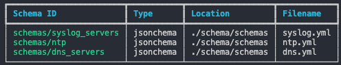

# The `schema` command

The `schema-enforcer schema` command is used to manage schemas. It can:

- List defined schemas, along with their type, location, and filename.
- Check that defined schemas are valid as schema definitions, and that schema unit tests pass.
- Generate invalid test results given a set of data which is intended to fail schema validation.

## Listing defined schemas

The `schema enforcer schema --list` command can be used to print out a table of defined schemas. These schemas are loaded based on the directory sctructure elucidated in the [README.md](../README.md) file at the root of the repository in the overview section.

```cli
bash$ cd examples/example3
bash$ schema-enforcer schema --list
```


## Checking defined schemas

The `schema-enforcer schema --check` command does two things.

1) Validates that schemas are valid according to spec (e.g. JSONSchema type schemas are validated as defined correctly according to the JSONSchema spec)
2) Runs defined unit tests

```cli
bash$ cd examples/example3
bash$ schema-enforcer schema --check
ALL SCHEMAS ARE VALID
```

Unit tests for schemas expect a certain directory hierarchy. Tests are placed inside of a schema-id specific directory which is nested in the `test_directory` (defaults to `tests`). The test_directory must be nested inside of the `main_directory`, which defaults to `schema`.

```cli
bash$ tree schema -L 2
schema
├── definitions
│   ├── arrays
│   ├── objects
│   └── properties
├── schemas
│   ├── dns.yml
│   ├── ntp.yml
│   └── syslog.yml
└── tests
    ├── dns_servers
    ├── ntp
    └── syslog_servers

9 directories, 3 files
```

> Note: The names of the main_directory and test_directory can be configured in a pyproject.toml file if you want to override the defaults. See [configuration.md](./configuration.md) for more information on how to do so.

When putting tests into a directory for a given schema ID, the short form of the schema ID is used as the directory name. The short form of the schema ID is generated by removing `/` from the schema ID and anything proceeding it. For example, the name of the test directory for the schema ID `schemas/ntp` is named `ntp` in the example above.

In example 3, tests have been written for three different schema definitions and placed in the directories `schemas/dns_servers`, `schemas/ntp`, and `schemas/syslog_servers`. We'll look at the tests written for the `schemas/ntp` schema ID in the following example.

```cli
bash$ cd examples/example3
bash$ tree schema/tests/ntp
├── invalid
│   ├── invalid_format
│   │   ├── data.yml
│   │   └── results.yml
│   ├── invalid_ip
│   │   ├── data.yml
│   │   └── results.yml
│   └── missing_required
│       ├── data.yml
│       └── results.yml
└── valid
    ├── full_implementation.json
    └── partial_implementation.json
```

Nested inside of the tests folder for each schema ID, there is an `invalid` directory and a `valid` directory. Tests which purposely generate invalid results (e.g. assert that a given set of data fails to adhere to the schema definition) should be placed inside of the `invalid` directory. Tests which purposely generate valid results (e.g. assert that a a given set of data adheres to the schema definition) should be placed in the `valid` directory.

In the invalid directory, three different test cases exist -- `invalid_format`, `invalid_ip`, and `missing_required`. Each of these test cases contains a `data` file and a `results` file. The data file must be named one of `data.yml`, `data.yaml`, or `data.json`. Similarly, the results file must be named one of `results.yml`, `results.yaml`, or `results.json`. When we assert that data fails to adhere to a given schema, we want not just to assert that it failed, but that it failed in the specific way we were expecting. This is why the invalid tests are each directories with `data` and `results` files defined.

In the valid directory, two different test cases exist -- `full_implementation` and `partial_implementation`. When we assert that data adheres to schema, there is no need to define the specific way in which validation passed, just that it passed. This is why these test cases are simply files of data which should pass schema validation rather than a directory with two separate file indicate data which should fail and the specific anticipated failure.

> Note: both valid and invalid test case data and results files can be named with extensions of .yml, .yaml, or .json.

In the following example, the `schemas/ntp` schema has an `invalid_format` test case defined. The data for the test case is as follows.

```yaml
bash$ cat schema/tests/ntp/invalid/invalid_format/data.yml
---
ntp_servers:
  - "10.1.1.1"
```

The expected results for the test case is as follows.

```yaml
bash$ cat schema/tests/ntp/invalid/invalid_format/results.yml
---
results:
  - result: "FAIL"
    schema_id: "schemas/ntp"
    absolute_path:
      - "ntp_servers"
      - "0"
    message: "'10.1.1.1' is not of type 'object'"
```

The `schemas/ntp` schema ID is used to validate this data as the folder it is nested in is `tests/ntp` and `ntp` is the short schema name of the schema ID `schemas/ntp`

```yaml
bash$ cat schema/schemas/ntp.yml
---
$schema: "http://json-schema.org/draft-07/schema#"
$id: "schemas/ntp"
description: "NTP Configuration schema."
type: "object"
properties:
  ntp_servers:
    $ref: "../definitions/arrays/ip.yml#ipv4_hosts"
  ntp_authentication:
    type: "boolean"
  ntp_logging:
    type: "boolean"
additionalProperties: false
required:
  - "ntp_servers"
something: "extra"
```

This schema definition includes a reference to the `ipv4_hosts` property inside of `schemas/definitions/arrays/ip.yml` which in turn references an object defiend in the object folder, and a property defined in the properties folder.

The data does not adhere to schema correctly because it should be a list (array) of dictionary (hash) type objects, of which the key `address` must be defined, and the value must be an IP address. If we change the data defined in `data.yml` to the following, data will pass schema validation (rather then failing). Because it is in the "invalid" folder, it is expected to fail, and thus we will see an error when schema validation checks are performed and the data passess adherence (unexpected result) instead of failing adherence (expected result)

```yaml
bash$ cat schema/tests/ntp/invalid/invalid_format/data.yml
---
ntp_servers:
  - address: "10.1.1.1"
```

```cli
bash$ schema-enforcer schema --check       
FAIL | [ERROR] Invalid test results do not match expected test results from /Users/ntc/schema_enforcer/examples/example3/schema/tests/ntp/invalid/invalid_format/results.yml [PROPERTY]
```

## Generating Invalid Test Results

The `schema-enforcer schema --generate-invalid` command allows a user to generate invalid unit tests results which are expected when data which does not correctly adhere to a schema definition is checked for adherence against that definition. These results are stored as JSON or YAML structured data.

In the following example we delete the `results.yaml` file from the `invalid_format` unit test.

```cli
bash$ cd examples/example3
bash$ rm schema/tests/ntp/invalid/invalid_format/results.yml
bash$ tree schema/tests/ntp/invalid
schema/tests/ntp/invalid
├── invalid_format
│   └── data.yml
├── invalid_ip
│   ├── data.yml
│   └── results.yml
└── missing_required
    ├── data.yml
    └── results.yml
```

When we run schema-enforcer in check mode now, schema enforcer generates a warning indicating that no results are defined for the ntp invalid_format test, and thus it will skip the test.

```cli
bash$ schema-enforcer schema --check                        
WARNING | Could not find expected_results_file /Users/ntc/schema_enforcer/examples/example3/schema/tests/ntp/invalid/invalid_format/results. Skipping...
ALL SCHEMAS ARE VALID
```

By using the `schema-enforcer schema --generate-invalid` command, we can generate the expected test results. Note, we have to pass in a `schema-id` for which `schema-enforcer` should generate results files. When this command is run, `schema-enforcer` generates results for every unit test for the given schema ID, so long as it has a data file defined.

```cli
bash$ schema-enforcer schema --generate-invalid --schema-id schemas/ntp
Generated/Updated results file: /Users/ntc/schema_enforcer/examples/example3/schema/tests/ntp/invalid/invalid_format/results.yml
Generated/Updated results file: /Users/ntc/schema_enforcer/examples/example3/schema/tests/ntp/invalid/invalid_ip/results.yml
Generated/Updated results file: /Users/ntc/schema_enforcer/examples/example3/schema/tests/ntp/invalid/missing_required/results.yml
```

We can see that a results.yml file has been placed inside of the ntp invalid_format unit test by the --generate-invalid command we ran above.

```cli
bash$ tree schema/tests/ntp/invalid
schema/tests/ntp/invalid
├── invalid_format
│   ├── data.yml
│   └── results.yml
├── invalid_ip
│   ├── data.yml
│   └── results.yml
└── missing_required
    ├── data.yml
    └── results.yml
```

When we inspect the invalid_format results.yml file, We see that the result is `"FAIL"` with a specific message. This is the result we expect in the event that the data defined in `data.yml` is checked for adherence against schema.

```yaml
---
results:
  - result: "FAIL"
    schema_id: "schemas/ntp"
    absolute_path:
      - "ntp_servers"
      - "0"
    message: "'10.1.1.1' is not of type 'object'"
```

The results generaged by schema enforcer must be checked to ensure they are the results expected per the data defined. If, for instance, you accidentally define the data file as data which adheres to schema correctly, while thinking the data should fail, the results file generated will be a data structure indicating the data should pass validation. When `schema-enforcer schema --check` is run in this case, the passing schema will not log an error.
